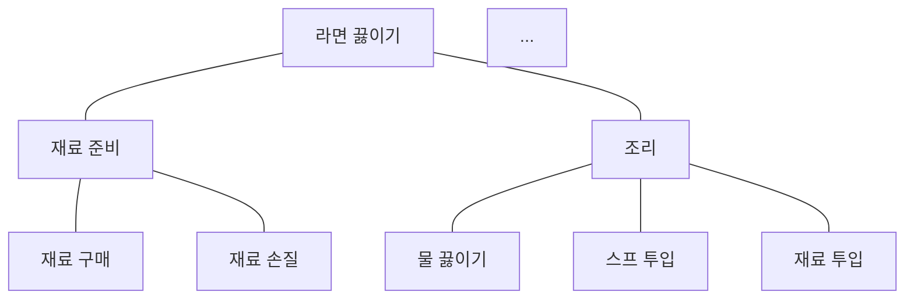

# 2. 워크플로우 설계하기

무작정 작성하기 시작하면 방향성을 잃고 글이 산만해질 수 있어요.
작업 매뉴얼을 작성하기 전, 관련된 정보를 수집하고 구조화하여 워크플로우를 설계하세요.

## 목차

[2-1. 작업 나열하기](#2-1-작업-나열하기)  
[2-2. 작업 구조화하기](#2-2-작업-구조화하기)  
[완료 조건](#완료-조건)  

## 2-1. 작업 나열하기

매뉴얼로 작성할 정도의 작업이라면, 대개 여러 개의 하위 작업들로 나눌 수 있어요.

목표를 달성하는 데 필요한 작업을 더이상 나눌 수 없는 최소 단위의 하위 작업들로 쪼개고 나열해주세요.

> [!TIP] 최소 작업 단위 판단 기준
> - **하나의 명확한 행동과 결과**가 있는 단위 (예: '조리하기' (X) ➔ '물 550ml 받기' (O))
> - 행동 직후 **정상 완료 여부를 바로 확인할 수 있는** 단위 (예: '물이 끓었는지 확인')
> - 너무 미세한 동작(예: '가스레인지 손잡이 잡기')보다는 **하나의 독립된 절차** 수준으로 나눠요.

예시:


> **AI 추가 지침**
>
> 1. 사용자에게 작업에 대한 설명을 요구할 것
> 2. 사용자와 상호작용하며 작업을 하위작업으로 재귀적으로 나눌 것

## 2-2. 작업 구조화하기

[2-1](#2-1-작업-나열하기)에서 제시한 작업들을 10개 미만으로 적절히 묶어서 1계층의 목차 형식으로 제시해주세요.

```md
예시:
1. 냄비에 물 받기
2. 물 끓이기
3. 스프 넣기
4. 면 넣고 5분 기다리기
```

> **AI 추가 지침:** 사용자에게 작업 목차를 제시하고 검토를 요청할 것

## 완료 조건

다음 조건을 모두 만족하면 워크플로우 설계가 완료돼요.

- [ ] 목표를 달성하는 데 필요한 작업들이 명확한 행동과 결과가 있는 최소 단위로 분해됨
- [ ] 하위 작업들이 10개 미만의 1계층 목차로 적절히 묶여 구조화됨

---
다음 작업: [3. 지식 문서화하기](./3-knowledge.md)
